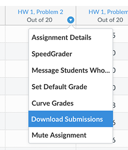

A zsh/python prolog grader designed to grade HMC CS81 prolog assignments downloaded from
canvas.

## How do I download the student assignments?

On the *Grades* section of the canvas, hover over the problem name and a dropdown menu will appear.
Click *Download Submissions*.



## Introduction

This is a python script that uses swi-prolog executable to run prolog scripts. Although we generally use prolog in interactive mode where we check whether some predicates are true, we can also make the prolog console write something to standard output (just like a python or C++ program) using the `writeln` predicate. Every time
writeln evaluates, it will print its argument. We then write a script to compare the output of swi-prolog
with the correct output.
For example, one can write a test as:

`:- (isPalindrome([0, 1, 1, 0]), writeln('true')) ; writeln('false').`

It reads: If `[0, 1, 1, 0]` is a palindrome, print true. Otherwise, print false. Here, you would ask the student to define the `isPalindrome` predicate. This script will then either print true or false depending on what the student has implemented. The correct output is `true`, so if this script prints true, the student will recieve a score.

When designing a test case, it is best to only **use only true-false tests and use only one test per file**.
True-false tests are better than enumeration (using forall predicate) tests. This is because the order of enumeration
is not guaranteed in prolog.
Our grader script ignores whitespace mismataches but care about the order in which things occur.
A student will get a +1 score if they pass one test file. So if you write every tests in one file, then a student
will either get a score of 0 or 1.


## Installing dependencies

The prolog script requires swi-prolog. It will try to access the command `swipl` using python subprocess module.
If you are working on mac, you can install swi-prolog as follows:

1. If you don't already have homebrew, install homebrew. Type in the terminal:
   `/usr/bin/ruby -e "$(curl -fsSL https://raw.githubusercontent.com/Homebrew/install/master/install)"`
2. Then install swi-prolog using homebrew: `brew install swi-prolog`

If you install using other methods (say you use linux or windows), don't forget to make swipl accessible by adding the path
to your .bash_profile

## How to use

Create a folder containing four subfolders: helpers, submissions, drivers, and solutions.

1. **Helpers** contains prolog .pl files that run in every tests in alphabetical order.
    You cannot have the same predicates defined in different
    files, so if a student is supposed to write the `accepts` predicate in their submissions file, you cannot
    add more rules to `accepts` in the helper files. 
    ([reference](http://www.swi-prolog.org/FAQ/Multifile.html))
    In DFA assignments, for example, one would create `DFAaccepts.pl` helper as follows:
    ```prolog
    accepts(Q, []) :- accepting(Q).
    accepts(Q, [Symbol | Rest]) :- transition(Q, Symbol, NewQ), accepts(NewQ, Rest).
    ```
2. The student **submissions** (.pl files) should go in submissions folder. It will get
   tested against each test case.
3. **Drivers** are your prolog testers files. These .pl files contain prolog
    command(s) to print to stdout to check whether the submission is correct
    ```prolog
    :- (isAlphabet(a), writeln('true')) ; writeln('false').
    ```
4. **Solutions** are the solutions for your drivers.
   For each of your driver, you must have a solution file with the same name but with .txt
   extension. These are the expected outputs (correct answers) for your drivers.

In the demo, let's assume that the students are assigned to write a prolog file
containing `isAlphabet(X)` predicate which should says `true` if and only if X is the symbol a, b, c, or d.
We test this with three tests. There are two positive tests which checks `isAlphabet(a)` and
`isAlphabet(b)` gives true. There is one negative test which checks that `isAlphabet(g)` is false.

When you ran the command `python3 grader.py demo` it will produce the following text to console:
```
Running the prolog grader on demo-after-run

##### grading submission: student1.pl #####
correct tests: 3 / 3
##### grading submission: student2.pl #####
correct tests: 2 / 3

People with not all correct outputs:
    student2
```

When you want to test the submissions, you create the four folders and add the necessary components.

You run this python script by calling `python3 grader.py [path-to-folder]` where path-to-folder is
the path to a folder containg the four folders listed above. Assuming that you
have the files in the correct places, it will output the students' score like this:

```
##### Grading submission: [submission file name] #####
CorrectTests: [score] / [total score]
##### Grading submission: [submission file name] #####
CorrectTests: [score] / [total score]
...
```

and store the outputs and errors of each test case in a new folder named results.
You can see an example of a results file in demo-after-run folder.

There are some examples from last year. See testsets folder.

## Remarks
1. It is often easier to read if you redirect the output of this script to text file.
2. There are some problems that you should be quite careful using the autograder.
   The man-hare-fox problem in CS81 FA18, for example, has many valid answers.
   The students are only asked to write a code that succesfully finds one of them.
   So the one that they find might not be the same one as the one in the test case.
   When a student got a problem wrong, it is best to check their code how they got
   it wrong if possible.
3. The reason that we have one test case per file instead of one file of many tests
   is because if we run into a time-limit exceed or some error, the students would
   still get the points for the later test cases.

Thanks Kye W. Shi for the first version of python rewrite.
